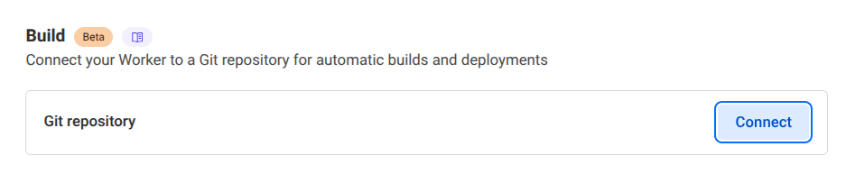
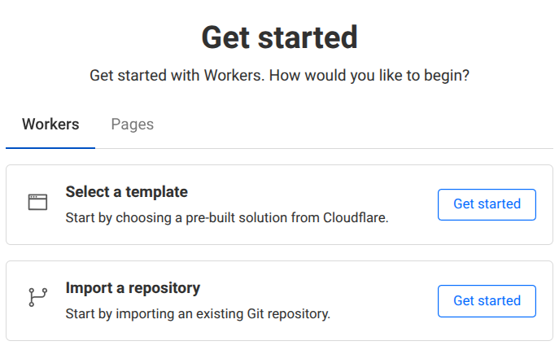

This is a starter kit for running a full-stack app quickly on Cloudflare without using a framework. 

First clone this repo then run it to start:

```sh
npm start
```

Now you can modify things to make it your own. 

## Database

### Schema

Edit [models.js](./functions/models.js) to update your database schema. It uses mostly the same syntax as Lit properties.

### Using the database

See the [D1 docs](https://github.com/treeder/flaregun/blob/main/README.md#d1-sqlite-database) in the flaregun repository.

## Layout

Edit [layout.js](./functions/layout.js) to update the layout of your app.

## Routes

This uses file based routing from [Cloudflare Pages Functions](https://developers.cloudflare.com/pages/functions/routing/), but runs on Workers 
because Pages Functions are deprecated. We only use the same routing as functions, otherwise, this is all Workers related. 

## Deploying to Production

This is two steps. 

1. Run setup script to create resources.
2. Manual deploy OR setup auto deploy

### Setup

This will create all your cloudflare resources such as your database and file storage. 

First get an [API token for Cloudflare](https://developers.cloudflare.com/fundamentals/api/get-started/create-token/) and get your account ID.

Choose "Edit Cloudflare Workers" template.


Keep all the same settings, but add `Read` access to D1.

Create a `.env` file with:

```sh
CLOUDFLARE_API_TOKEN=X
CLOUDFLARE_ACCOUNT_ID=Y
```

Then run:

```sh
npm run setup
```

### Deploy

To manually deploy:

```sh
npm run deploy
```

### Auto Deploy

This is the better way to go so it's all automated and will deploy on every commit. 

Set build command to:

```sh
npm run build
```

If you've already deployed, go your work applications settings and connect your GitHub repository:



If you haven't deployed yet, go to Workers section, click Create then choose "import a repository"



### Deploying dev environment

This will run a separate instance with separate database and other resources. 

```sh
npm run deploy:dev
```
