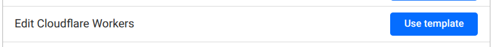

# Flaregun Starter Kit

This is a starter kit for running a full-stack app quickly on Cloudflare without a complex framework. Pure JavaScript and standard technology to prevent lock-in.

Super lightweight, super fast, easy to understand, no magic (well, just a little). Uses [flaregun](https://github.com/treeder/flaregun) for an awesome Cloudflare experience.

Out of the box, this includes: database, file storage, server side rendering, API endpoints, queues, scheduler, tests and material 3 web components for the client side. It's easy to add and remove 
things you need or don't since there it's mostly just standard JavaScript. 

## Getting started

You can get up and running in seconds (literally).

Click `Use this template` button in the top right:


Then clone and run your new repo with:

```sh
npm start
```

Now view the demo page at http://localhost:8787.

Try making some changes and see it update in real-time!

## Database

### Schema / migrations

Define models [models](https://github.com/treeder/models) in the [data](./functions/data) folder, then add the class to [migrations.js](./functions/data/migrations.js) to automatically keep your database schema up to date.

### Using the database

See the [D1 docs](https://github.com/treeder/flaregun/blob/main/README.md#d1-sqlite-database) in the flaregun repository.

## Layout

Edit [layout.js](./functions/layout.js) to update the layout of your app.

## Routes

This uses file based routing from [Cloudflare Pages Functions](https://developers.cloudflare.com/pages/functions/routing/), but runs on Workers because Pages Functions are deprecated.

To add a new route, just add a new file to the functions directory and that will be your route.

For UI endpoints:

```js
import { html } from 'rend'

export async function onRequestGet(c) {
  return await c.data.rend.html({
    main: render,
  })
}

function render(d) {
  return html` <div>Hello world!</div> `
}
```

For API endpoints:

```js
export async function onRequestGet(c) {
  return Response.json({
    hello: 'world',
  })
}
```

## Scheduler

See [scheduled.js](functions/scheduled.js). This will run every minute with the default configuration.

NOTE: There are some gotchas here:

- This won't run any middleware, so you'll have to do any initialization you need in the scheduled function.
- To import something like a class or function in scheduled.js, it must also be used elsewhere in your app.

That's about it, otherwise, should work as is!

## Queues

TODO

## Testing

This is configured to do some basic API testing with [testkit](https://github.com/treeder/testkit). See [test/test.js](test/test/js) for more details. Run tests with `npm run testkit` and add that line to your CI.

## Deploying

This is two steps.

1. Run setup script to create all the resources on Cloudflare.
2. Deploy!

### Setup

This will create all your cloudflare resources such as your database and file storage.

- First get an [API token for Cloudflare](https://developers.cloudflare.com/fundamentals/api/get-started/create-token/) and get your account ID.
- Choose "Edit Cloudflare Workers" template.



Keep all the same settings, but also add D1 with write access.

Create a `.env` file with:

```sh
CLOUDFLARE_API_TOKEN=X
CLOUDFLARE_ACCOUNT_ID=Y
```

Then run:

```sh
npm run setup
```

### Manual deploy

```sh
npm run deploy
```

### Auto deploy

Setup auto deploy in the Cloudflare Dashboard so every commit to main will deploy and other
branches will get a preview URL.

Set build command to:

```sh
npm run build
```

Set deploy command to:

```sh
npm run deploy
```

Set non-production branch deploy command to:

```sh
npm run deploy:preview
```

### Deploying to production

```sh
npm run deploy:prod
```

Then your auto deploy configuration should change to:

- `npm run build`
- `npm run deploy:prod`
- Preview URLs: You may not want to have preview URLs on production, but if you do, use: `npm run deploy:prod:preview`.
